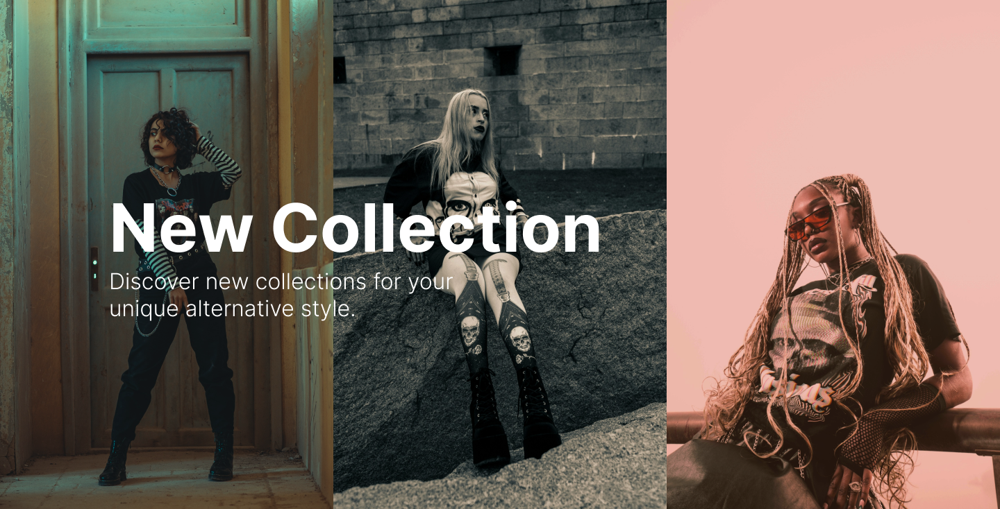

# Trend Styles

> Um projeto ecommerce com foco em produtos para estilo alternativo.

## 🚀 Instalando

Para configurar o projeto no seu computador, siga estes passos:

* Clone o repositório usando o Git: `git clone https://github.com/Mathh19/trend-style.git`.
* Navegue até o diretório do projeto: `cd trend-styles`.
* Instale as dependências do projeto: `npm install`.
* Inicie o servidor de desenvolvimento local: `npm run dev`.
